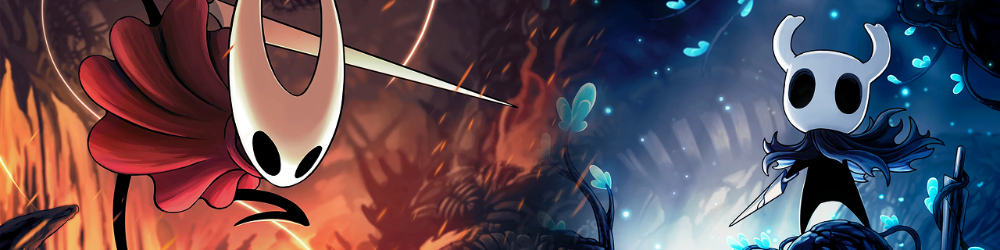

  

# 👋 Hi, I'm Pedro!

I build mobile apps with **Flutter**. I'm basically a kid who learned to code because I wanted to see my ideas actually come to life. When I’m not building apps, I’m usually messing around with game dev stuff.

Current Objective: Training for WorldSkills Aichi 2028
Side Projects: Some games and random flutter apps

---

### Tools I use
* **Actual Coding:** Flutter & Dart
* **Backend:** Firebase & Node
* **Design:** Figma
* **Hobbies:** Unity & Roblox Studio

### What I’m up to
* Trying to make my Flutter UIs look cleaner.
* Building my dream game slowly but surely.
* Just making things that look good and work well.

 ### 🎮 On the radar

  

 **All-time favorites:**
  * ⚔️ **Hollow Knight:** Amazing game, Amazing sequel, amazing everything
---
### 📈 Stats

   
  

