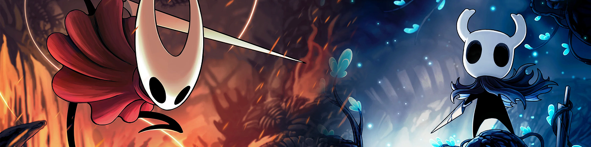

  

# 👋 Hi, I'm Pedro!

I build mobile apps with **Flutter**. I'm basically a kid who learned to code because I wanted to see my ideas actually come to life. When I’m not in mobile dev, I’m usually messing around with game dev stuff.

Current Objective: Training for WorldSkills Aichi 2028 on Mobile Applications Development
Side Projects: Some games and random apps

---

### Tools I use
* **Frontend:** Flutter & Dart
* **Backend:** Firebase, Node & Rust (learning)
* **Design:** Figma
* **Hobbies:** Unity

### What I’m up to
* Trying to make my Flutter UIs look cleaner.
* Building my dream game slowly but surely.
* Just making things that look good and work well.

 ### 🎮 On the radar

  

 **All-time favorites:**
  * ⚔️ **Hollow Knight:** Amazing game, Amazing sequel, amazing everything
---

### Check out my best projects:
[BacklogRoulette](https://github.com/pedrokGs/BacklogRoulette) - A random game roulette which selects one of your steam games for you to play using a mood system, so you can finally get to play one of those game you bought but never played.

And for now that is the only one!

### Fun Stat Stuffs

   
  

